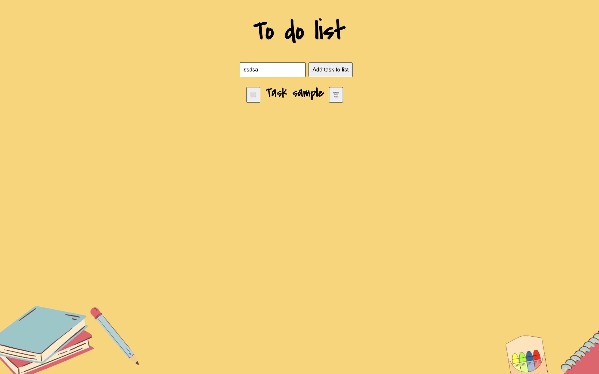

# To-Do List

A simple browser-based to-do list app built with plain HTML, CSS, and JavaScript.

## Features
- Add a new task from the input field
- Prevent empty tasks from being added
- Mark tasks as complete/incomplete with a checkbox button
- Hide tasks from the list with a delete button
- Styled notebook-like UI with custom background and Google Font

## 📸 Preview

## Live Demo of site
[View Live Site](https://jmg002050.github.io/to-do-list/)

## Project Structure
- `index.html` - app layout and UI elements
- `style.css` - visual styling for layout, buttons, and task states
- `script.js` - task creation and interaction logic
- `resources/images/background.png` - page background image

## Getting Started
1. Clone or download this repository.
2. Open `index.html` in your browser.

No build tools or package installation are required.

## How to Use
1. Type a task into the input box.
2. Click **Add task to list**.
3. Click `⬜️` to mark a task as completed (`✅`).
4. Click `🗑️` to hide a task from view.

## Notes
- Tasks are not persisted yet (refreshing the page resets the list).
- The current delete behavior hides tasks instead of permanently removing them from the DOM.

## Future Improvements
- Save tasks using `localStorage`
- Add keyboard support (Enter key to add task)
- Add filters (All / Active / Completed)
- Add edit-in-place support for existing tasks
